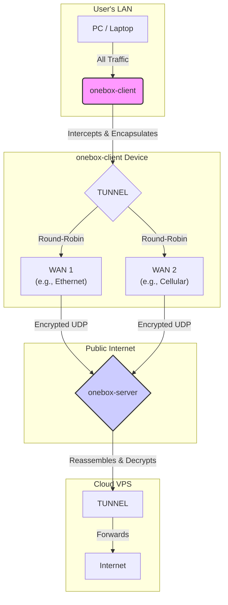
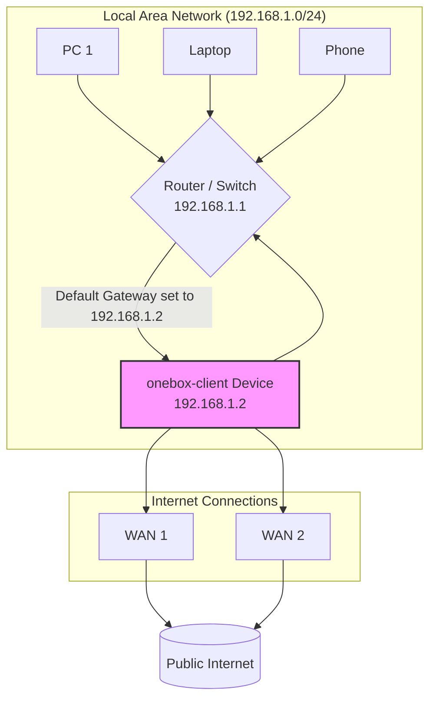
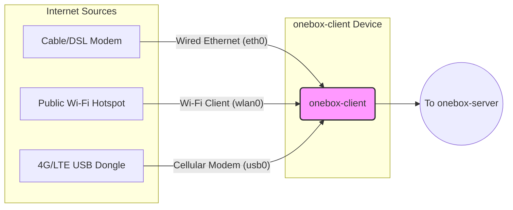
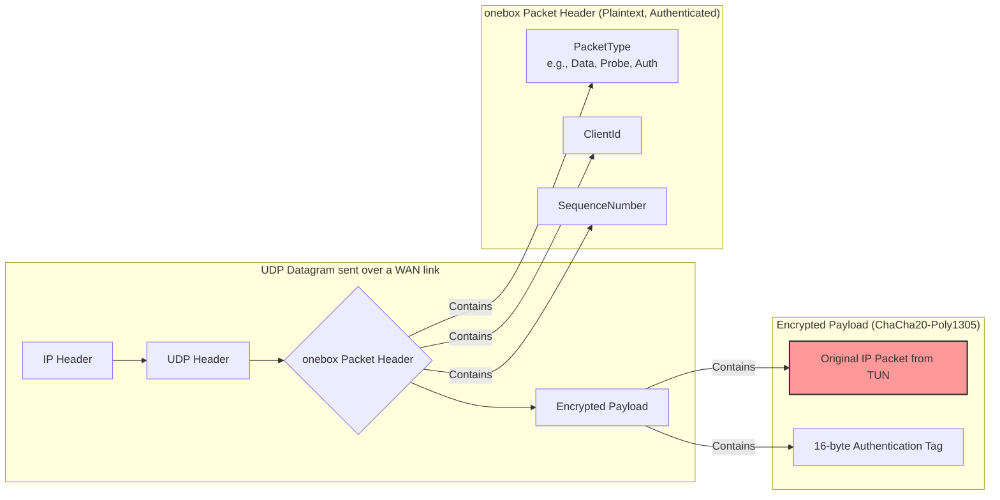
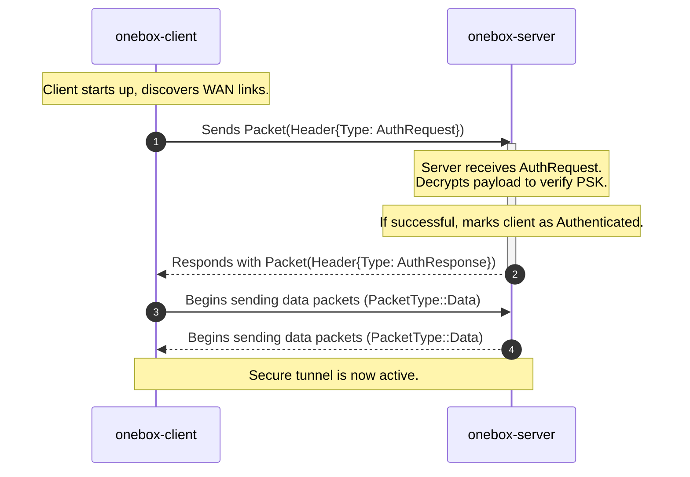
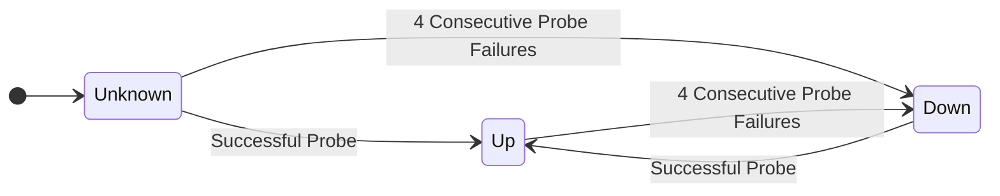
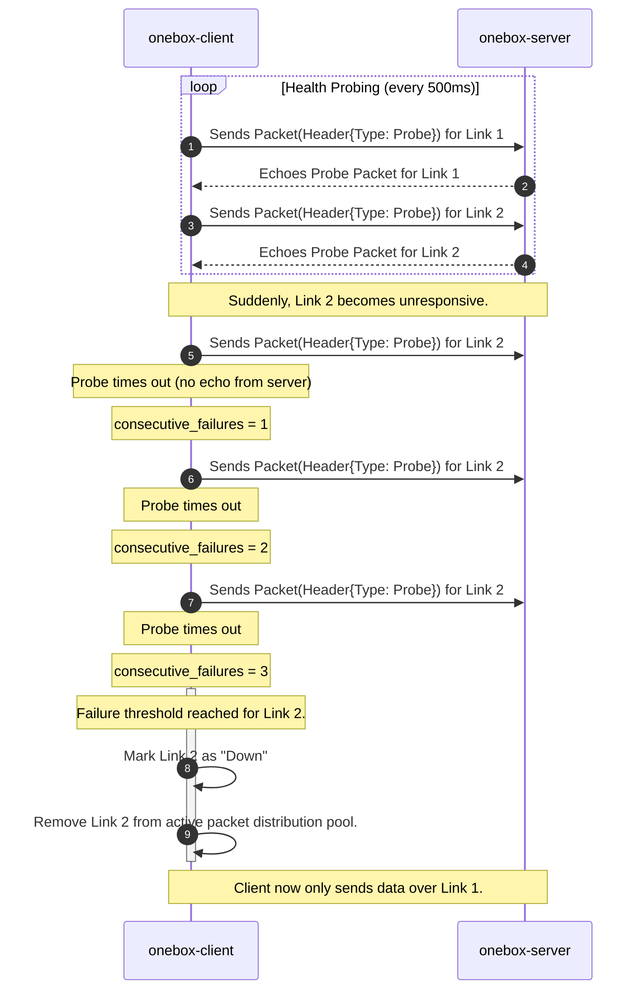
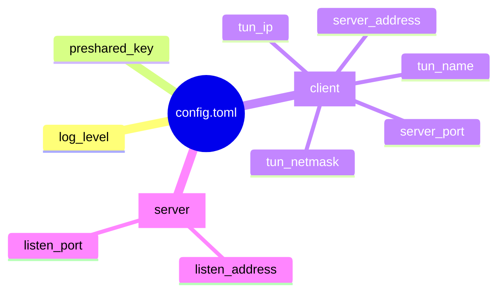
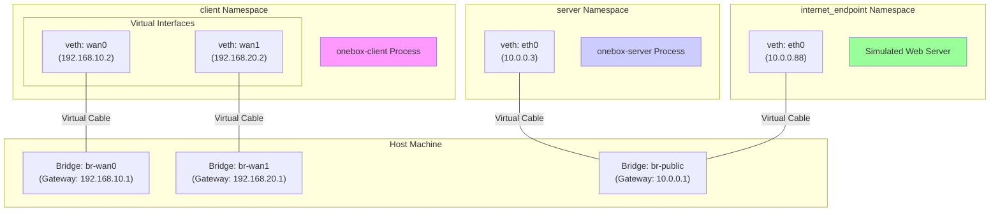

# onebox-rs

[](https://opensource.org/licenses/MIT)
[](https://www.rust-lang.org)
[](https://www.linux.org)

**High-performance, secure internet bonding solution built in Rust**

onebox-rs aggregates multiple internet connections into a single, resilient virtual connection, providing faster speeds and seamless failover for individuals and small businesses.

## 🚀 Features

- **🔄 Internet Bonding**: Combine multiple WAN connections (Wi-Fi, Ethernet, Cellular) for increased bandwidth
- **🛡️ Seamless Failover**: Automatic failover when connections drop, with zero packet loss
- **🔒 End-to-End Encryption**: ChaCha20-Poly1305 encryption for all tunnel traffic
- **📊 Link Health Monitoring**: Real-time monitoring of connection latency, jitter, and packet loss
- **⚡ High Performance**: Built with Rust and Tokio for minimal CPU overhead
- **🖥️ Cross-Platform**: Client runs on ARM64 (Raspberry Pi) and server on x86_64 (VPS)
- **🔧 Easy Configuration**: Simple TOML-based configuration
- **📱 CLI Interface**: Intuitive command-line tools for management and monitoring

## 🏗️ Architecture

onebox-rs consists of two main components: a client and a server. The client captures all network traffic from the local machine, sends it across multiple internet connections to the server, which then decrypts and forwards it to the public internet.

*Click on the client or server nodes to see more detailed workflows.*



### Client (`onebox-client`)
- Runs on Linux-based single-board computers (e.g., Raspberry Pi)
- Creates a TUN interface to capture all outgoing traffic
- Automatically discovers available WAN interfaces
- Distributes packets across multiple connections using round-robin algorithm
- Monitors link health and performs failover

### Server (`onebox-server`)
- Runs on cloud VPS with public IP
- Receives encrypted packets from clients
- Reassembles packets in correct order using sequence numbers
- Forwards traffic to the internet using NAT
- Handles multiple concurrent client connections

## 🏕️ Deployment Scenarios

### LAN Topology Example
In a typical setup, all devices on a local network are configured to use the `onebox-client` device as their internet gateway. This allows all traffic to be transparently routed through the bonded tunnel.



### WAN Connection Examples
The `onebox-client` can bond various types of internet connections simultaneously.



## 📦 Protocol

All traffic is sent as UDP datagrams. The payload of each UDP packet contains a custom `onebox` header followed by an encrypted payload.

### Packet Structure


### Jitter Buffer
The server uses a jitter buffer to reorder packets that may arrive out of sequence from different WAN links.

```mermaid
graph TD
    A[Data Packet Arrives (Seq=S)] --> B{Insert (S, Packet) into <br> BTreeMap Jitter Buffer};
    B --> C{Is this the first ever <br> packet from this client?};
    C -- Yes --> D[Set next_expected_seq = S];
    C -- No --> E;
    D --> E{Loop while buffer contains <br> packet with Seq == next_expected_seq};

    E -- True --> F[Remove packet from buffer];
    F --> G[Write packet to TUN interface];
    G --> H[Increment next_expected_seq];
    H --> E;

    E -- False --> I[Wait for more packets];
```

## ⚙️ Common Workflows

### Client Authentication

The client authenticates with the server using a simple handshake. This ensures that only clients with the correct Pre-Shared Key (PSK) can connect.



### Link Failover & State Machine

The client constantly monitors the health of each WAN link by sending probes. If a link becomes unresponsive, it is quickly removed from the pool of active links. The state of each link is managed as follows:



Here is the sequence of events during a link failure:



## 📋 Requirements

### Client Requirements
- Linux-based system (ARM64 or x86_64)
- Root privileges or `CAP_NET_ADMIN` capability
- Multiple network interfaces (Wi-Fi, Ethernet, Cellular, etc.)
- Rust 1.70+ toolchain

### Server Requirements
- Linux VPS with public IP address
- Root privileges
- Open UDP port (configurable)
- Rust 1.70+ toolchain

## 🛠️ Installation

### Prerequisites

1. **Install Rust** (if not already installed):
   ```bash
   curl --proto '=https' --tlsv1.2 -sSf https://sh.rustup.rs | sh
   source ~/.cargo/env
   ```

2. **Install system dependencies**:
   ```bash
   # Ubuntu/Debian
   sudo apt update
   sudo apt install build-essential pkg-config libssl-dev
   
   # CentOS/RHEL
   sudo yum groupinstall "Development Tools"
   sudo yum install openssl-devel
   ```

### Building from Source

1. **Clone the repository**:
   ```bash
   git clone https://github.com/yourusername/onebox-rs.git
   cd onebox-rs
   ```

2. **Build the project**:
   ```bash
   cargo build --release
   ```

3. **Install binaries** (optional):
   ```bash
   cargo install --path .
   ```

## ⚙️ Configuration

The system is configured via a `config.toml` file. The schema is as follows:



### Client Configuration (`config.toml`)

Create a `config.toml` file in the client's working directory:

```toml
[client]
server_address = "your-server-ip.com"
server_port = 8080
preshared_key = "your-secure-preshared-key"
log_level = "info"

[client.tun]
name = "onebox0"
ip = "10.0.0.2"
netmask = "255.255.255.0"
```

### Server Configuration (`config.toml`)

Create a `config.toml` file in the server's working directory:

```toml
[server]
listen_address = "0.0.0.0"
listen_port = 8080
preshared_key = "your-secure-preshared-key"
log_level = "info"

[server.tun]
name = "onebox0"
ip = "10.0.0.1"
netmask = "255.255.255.0"
```

## 🚀 Usage

### Starting the Server

1. **On your VPS**:
   ```bash
   sudo ./target/release/onebox-server start
   ```

2. **Check server status**:
   ```bash
   ./target/release/onebox-server status
   ```

### Starting the Client

1. **On your local machine/Raspberry Pi**:
   ```bash
   sudo ./target/release/onebox-client start
   ```

2. **Check client status**:
   ```bash
   ./target/release/onebox-client status
   ```

3. **Stop the client**:
   ```bash
   sudo ./target/release/onebox-client stop
   ```

### Verifying the Connection

Test your bonded connection:

```bash
# Test basic connectivity
ping 8.8.8.8

# Test bandwidth
curl -o /dev/null http://speedtest.tele2.net/100MB.zip

# Check routing
ip route show
```

## 🧪 Testing

The project includes a comprehensive integration test suite that runs in an isolated network environment created with network namespaces.

### Test Environment Topology

The `setup_net_env.sh` script creates a virtual network of bridges and namespaces to simulate the client, the server, and the public internet. This allows for end-to-end testing without requiring a real cloud VPS or multiple physical network connections.



### Running Tests

To run all tests, including the integration tests, use the following command. The `--test-threads=1` flag is required to run the integration tests sequentially, as they manipulate shared network resources.

```bash
cargo test -- --test-threads=1
```

## 🔧 Development

### Project Structure

```
onebox-rs/
├── Cargo.toml              # Workspace configuration
├── onebox-core/            # Core library (shared types, protocol)
├── onebox-client/          # Client binary
├── onebox-server/          # Server binary
├── docs/                   # Documentation
│   ├── diagrams/
│   │   ├── 01-overview/
│   │   ├── 02-protocol/
│   │   ├── 03-workflows/
│   │   ├── 04-testing/
│   │   └── 05-configuration/
│   ├── PRD.md
│   ├── SRS.md
│   ├── TEST_PLAN.md
│   └── TASK_LIST.md
└── README.md               # This file
```

### Building for Development

```bash
# Development build
cargo build

# Format code
cargo fmt

# Lint code
cargo clippy -- -D warnings
```

## 📚 Documentation

- **[Product Requirements Document](docs/PRD.md)**: High-level vision and goals
- **[Software Requirements Specification](docs/SRS.md)**: Detailed technical specifications
- **[Test Plan](docs/TEST_PLAN.md)**: Testing scenarios and validation procedures
- **[Task List](docs/TASK_LIST.md)**: Implementation roadmap and progress

## 🤝 Contributing

We welcome contributions! Please see our contributing guidelines:

1. Fork the repository
2. Create a feature branch (`git checkout -b feature/amazing-feature`)
3. Commit your changes (`git commit -m 'Add amazing feature'`)
4. Push to the branch (`git push origin feature/amazing-feature`)
5. Open a Pull Request

### Development Guidelines

- Follow Rust coding standards
- Ensure all tests pass
- Update documentation as needed
- Use conventional commit messages

## 📄 License

This project is licensed under the MIT License - see the [LICENSE](LICENSE) file for details.

## ⚠️ Disclaimer

This software requires root privileges to create TUN interfaces and modify routing tables. Use at your own risk and ensure you understand the security implications of running network-level software with elevated privileges.

## 🆘 Support

- **Issues**: Report bugs and feature requests on [GitHub Issues](https://github.com/yourusername/onebox-rs/issues)
- **Discussions**: Join community discussions on [GitHub Discussions](https://github.com/yourusername/onebox-rs/discussions)
- **Wiki**: Check our [Wiki](https://github.com/yourusername/onebox-rs/wiki) for additional documentation

## 🙏 Acknowledgments

- Built with [Rust](https://rust-lang.org) and [Tokio](https://tokio.rs)
- Inspired by existing internet bonding solutions
- Community contributors and testers

---

**Made with ❤️ in Rust**

## 🎨 D2 Diagrams

Here are the same diagrams, rendered using D2.

### System Architecture
```d2
direction: right

Users_LAN: {
  pc: 'PC / Laptop'
  onebox_client: 'onebox-client'
}

onebox_client_Device: {
  onebox_client -> TUNNEL
  TUNNEL -> 'WAN 1'
  TUNNEL -> 'WAN 2'
}

Public_Internet: {
  'WAN 1' -> 'onebox-server'
  'WAN 2' -> 'onebox-server'
}

Cloud_VPS: {
  'onebox-server' -> TUNNEL
  TUNNEL -> Internet
}

Users_LAN.pc -> Users_LAN.onebox_client
onebox_client_Device.onebox_client -> Public_Internet.'WAN 1'
onebox_client_Device.onebox_client -> Public_Internet.'WAN 2'
Public_Internet.'onebox-server' -> Cloud_VPS.TUNNEL
Cloud_VPS.TUNNEL -> Cloud_VPS.Internet

'onebox-client'.style.fill: "#f9f"
'onebox-server'.style.fill: "#ccf"
```

### Link Failover
```d2
diagram: sequence
'onebox-client' -> 'onebox-server': Probe Link 1
'onebox-server' -> 'onebox-client': Echo
'onebox-client' -> 'onebox-server': Probe Link 2
'onebox-server' -> 'onebox-client': Echo

'note over onebox-client, onebox-server': 'Link 2 becomes unresponsive'

'onebox-client' -> 'onebox-server': Probe Link 2 {style.stroke: red}
'note left of onebox-client': 'Timeout... failures: 1'
'onebox-client' -> 'onebox-server': Probe Link 2 {style.stroke: red}
'note left of onebox-client': 'Timeout... failures: 2'
'onebox-client' -> 'onebox-server': Probe Link 2 {style.stroke: red}
'note left of onebox-client': 'Timeout... failures: 3'

'onebox-client': {
  'Link 2 marked as DOWN': {
    style: {
      fill: red
    }
  }
}
```

### Packet Structure
```d2
direction: right

UDP_Datagram: {
  IP_Header -> UDP_Header
  UDP_Header -> onebox_Packet_Header
  onebox_Packet_Header -> Encrypted_Payload
}

onebox_Packet_Header: {
  shape: package
  'onebox Packet Header (Plaintext, Authenticated)': {
    PacketType: 'e.g., Data, Probe, Auth'
    ClientId
    SequenceNumber
  }
}

Encrypted_Payload: {
  shape: package
  'Encrypted Payload (ChaCha20-Poly1305)': {
    'Original IP Packet from TUN'
    '16-byte Authentication Tag'
  }
}
```

### Jitter Buffer
```d2
direction: down

'Data Packet Arrives (Seq=S)' -> 'Insert (S, Packet) into BTreeMap Jitter Buffer'
'Insert (S, Packet) into BTreeMap Jitter Buffer' -> 'Is this the first ever packet from this client?'

'Is this the first ever packet from this client?' -> 'Set next_expected_seq = S': Yes
'Is this the first ever packet from this client?' -> 'Loop while buffer contains packet with Seq == next_expected_seq': No

'Set next_expected_seq = S' -> 'Loop while buffer contains packet with Seq == next_expected_seq'

'Loop while buffer contains packet with Seq == next_expected_seq)' -> 'Remove packet from buffer': True
'Remove packet from buffer' -> 'Write packet to TUN interface'
'Write packet to TUN interface' -> 'Increment next_expected_seq'
'Increment next_expected_seq' -> 'Loop while buffer contains packet with Seq == next_expected_seq'

'Loop while buffer contains packet with Seq == next_expected_seq' -> 'Wait for more packets': False
```

### Client Logic Flow
```d2
direction: down

Start -> 'Parse CLI Arguments'
'Parse CLI Arguments' -> 'Load config.toml'
'Load config.toml' -> 'Discover WAN Interfaces & Bind Sockets'
'Discover WAN Interfaces & Bind Sockets' -> 'Create Virtual TUN Device'
'Create Virtual TUN Device' -> 'Set System Default Route to TUN Device'
'Set System Default Route to TUN Device' -> 'Perform Handshake with Server'
'Perform Handshake with Server' -> 'Spawn Concurrent Tasks'

'Spawn Concurrent Tasks' -> 'Task 1: TUN to UDP'
'Spawn Concurrent Tasks' -> 'Task 2: UDP to TUN'
'Spawn Concurrent Tasks' -> 'Task 3: Health Probers'
'Spawn Concurrent Tasks' -> 'Task 4: Status Socket'
```

### Server Logic Flow
```d2
direction: down

Start -> 'Parse CLI & Load Config'
'Parse CLI & Load Config' -> 'Create TUN Device, Setup IP Forwarding & NAT'
'Create TUN Device, Setup IP Forwarding & NAT' -> 'Bind Public UDP Socket'
'Bind Public UDP Socket' -> 'Spawn Main Tasks'

'Spawn Main Tasks' -> 'Task 1: Dispatcher'
'Task 1: Dispatcher' -> 'Task 2: Worker Pool'
'Spawn Main Tasks' -> 'Task 3: TUN to UDP'
```

### Link State Machine
```d2
direction: right

Unknown -> Up: 'Successful Probe'
Up -> Down: '4 Consecutive Probe Failures'
Down -> Up: 'Successful Probe'
Unknown -> Down: '4 Consecutive Probe Failures'
```

### Configuration Schema
```d2
'config.toml': {
  log_level
  preshared_key

  client: {
    server_address
    server_port
    tun_name
    tun_ip
    tun_netmask
  }

  server: {
    listen_address
    listen_port
  }
}
```