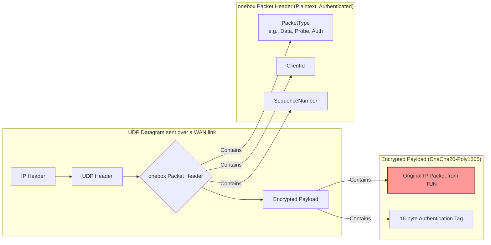
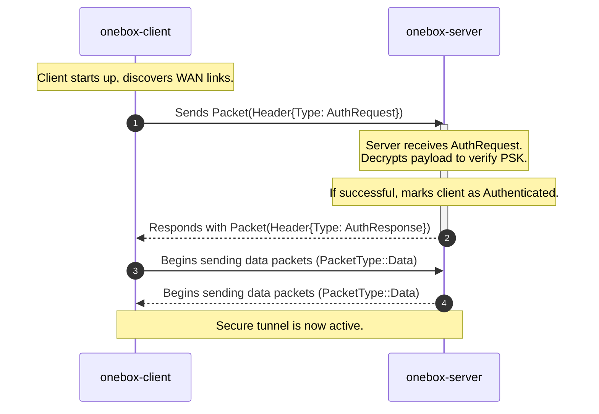
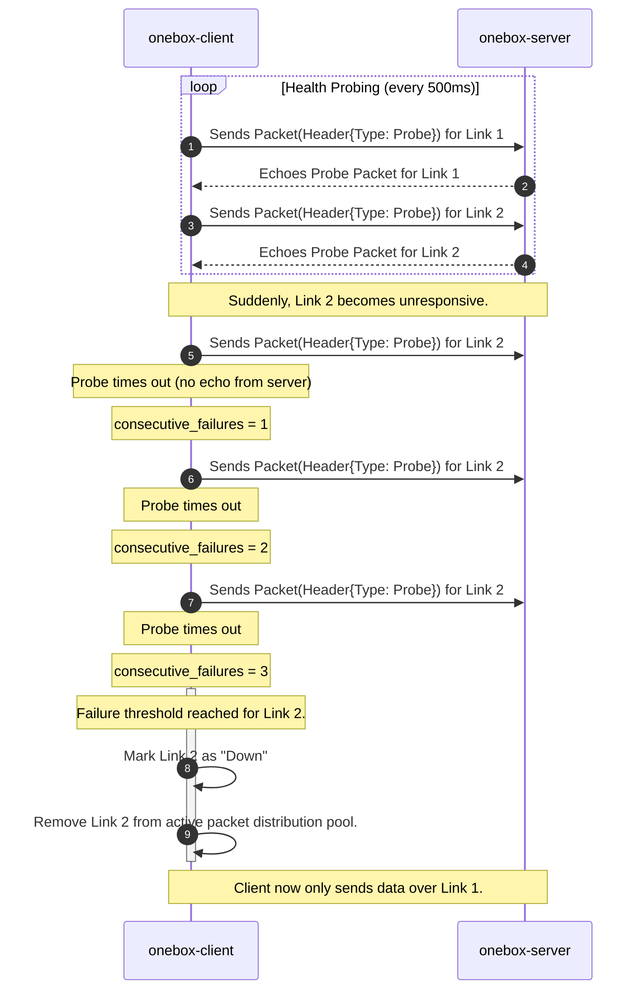
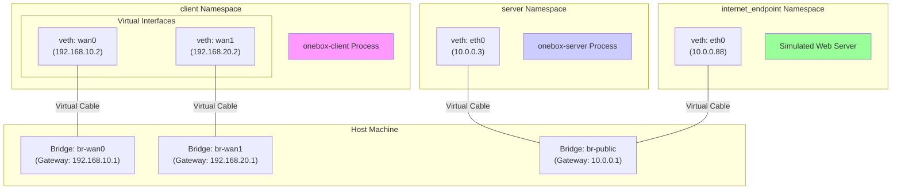

# onebox-rs

[](https://opensource.org/licenses/MIT)
[](https://www.rust-lang.org)
[](https://www.linux.org)

**High-performance, secure internet bonding solution built in Rust**

onebox-rs aggregates multiple internet connections into a single, resilient virtual connection, providing faster speeds and seamless failover for individuals and small businesses.

## 🚀 Features

- **🔄 Internet Bonding**: Combine multiple WAN connections (Wi-Fi, Ethernet, Cellular) for increased bandwidth
- **🛡️ Seamless Failover**: Automatic failover when connections drop, with zero packet loss
- **🔒 End-to-End Encryption**: ChaCha20-Poly1305 encryption for all tunnel traffic
- **📊 Link Health Monitoring**: Real-time monitoring of connection latency, jitter, and packet loss
- **⚡ High Performance**: Built with Rust and Tokio for minimal CPU overhead
- **🖥️ Cross-Platform**: Client runs on ARM64 (Raspberry Pi) and server on x86_64 (VPS)
- **🔧 Easy Configuration**: Simple TOML-based configuration
- **📱 CLI Interface**: Intuitive command-line tools for management and monitoring

## 🏗️ Architecture

onebox-rs consists of two main components: a client and a server. The client captures all network traffic from the local machine, sends it across multiple internet connections to the server, which then decrypts and forwards it to the public internet.

```mermaid
graph TD
    subgraph "User's LAN"
        A[PC / Laptop] -- All Traffic --> B(onebox-client);
    end

    subgraph "onebox-client Device"
        B -- Intercepts & Encapsulates --> C{TUNNEL};
        C -- Round-Robin --> D[WAN 1 <br> (e.g., Ethernet)];
        C -- Round-Robin --> E[WAN 2 <br> (e.g., Cellular)];
    end

    subgraph "Public Internet"
        D -- Encrypted UDP --> F{onebox-server};
        E -- Encrypted UDP --> F;
    end

    subgraph "Cloud VPS"
        F -- Reassembles & Decrypts --> G[TUNNEL];
        G -- Forwards --> H[Internet];
    end

    style B fill:#f9f,stroke:#333,stroke-width:2px
    style F fill:#ccf,stroke:#333,stroke-width:2px

    click F "#-protocol" "Go to Protocol Details"
    click B "#-common-workflows" "Go to Common Workflows"
```

### Client (`onebox-client`)
- Runs on Linux-based single-board computers (e.g., Raspberry Pi)
- Creates a TUN interface to capture all outgoing traffic
- Automatically discovers available WAN interfaces
- Distributes packets across multiple connections using round-robin algorithm
- Monitors link health and performs failover

### Server (`onebox-server`)
- Runs on cloud VPS with public IP
- Receives encrypted packets from clients
- Reassembles packets in correct order using sequence numbers
- Forwards traffic to the internet using NAT
- Handles multiple concurrent client connections

## 📦 Protocol

All traffic is sent as UDP datagrams. The payload of each UDP packet contains a custom `onebox` header followed by an encrypted payload.



## ⚙️ Common Workflows

### Client Authentication

The client authenticates with the server using a simple handshake. This ensures that only clients with the correct Pre-Shared Key (PSK) can connect.



### Link Failover

The client constantly monitors the health of each WAN link by sending probes. If a link becomes unresponsive, it is quickly removed from the pool of active links.



## 📋 Requirements

### Client Requirements
- Linux-based system (ARM64 or x86_64)
- Root privileges or `CAP_NET_ADMIN` capability
- Multiple network interfaces (Wi-Fi, Ethernet, Cellular, etc.)
- Rust 1.70+ toolchain

### Server Requirements
- Linux VPS with public IP address
- Root privileges
- Open UDP port (configurable)
- Rust 1.70+ toolchain

## 🛠️ Installation

### Prerequisites

1. **Install Rust** (if not already installed):
   ```bash
   curl --proto '=https' --tlsv1.2 -sSf https://sh.rustup.rs | sh
   source ~/.cargo/env
   ```

2. **Install system dependencies**:
   ```bash
   # Ubuntu/Debian
   sudo apt update
   sudo apt install build-essential pkg-config libssl-dev
   
   # CentOS/RHEL
   sudo yum groupinstall "Development Tools"
   sudo yum install openssl-devel
   ```

### Building from Source

1. **Clone the repository**:
   ```bash
   git clone https://github.com/yourusername/onebox-rs.git
   cd onebox-rs
   ```

2. **Build the project**:
   ```bash
   cargo build --release
   ```

3. **Install binaries** (optional):
   ```bash
   cargo install --path .
   ```

## ⚙️ Configuration

### Client Configuration (`config.toml`)

Create a `config.toml` file in the client's working directory:

```toml
[client]
server_address = "your-server-ip.com"
server_port = 8080
preshared_key = "your-secure-preshared-key"
log_level = "info"

[client.tun]
name = "onebox0"
ip = "10.0.0.2"
netmask = "255.255.255.0"
```

### Server Configuration (`config.toml`)

Create a `config.toml` file in the server's working directory:

```toml
[server]
listen_address = "0.0.0.0"
listen_port = 8080
preshared_key = "your-secure-preshared-key"
log_level = "info"

[server.tun]
name = "onebox0"
ip = "10.0.0.1"
netmask = "255.255.255.0"
```

## 🚀 Usage

### Starting the Server

1. **On your VPS**:
   ```bash
   sudo ./target/release/onebox-server start
   ```

2. **Check server status**:
   ```bash
   ./target/release/onebox-server status
   ```

### Starting the Client

1. **On your local machine/Raspberry Pi**:
   ```bash
   sudo ./target/release/onebox-client start
   ```

2. **Check client status**:
   ```bash
   ./target/release/onebox-client status
   ```

3. **Stop the client**:
   ```bash
   sudo ./target/release/onebox-client stop
   ```

### Verifying the Connection

Test your bonded connection:

```bash
# Test basic connectivity
ping 8.8.8.8

# Test bandwidth
curl -o /dev/null http://speedtest.tele2.net/100MB.zip

# Check routing
ip route show
```

## 🔧 Development

### Project Structure

```
onebox-rs/
├── Cargo.toml              # Workspace configuration
├── onebox-core/            # Core library (shared types, protocol)
├── onebox-client/          # Client binary
├── onebox-server/          # Server binary
├── docs/                   # Documentation
│   ├── diagrams/
│   │   ├── 01-overview/
│   │   ├── 02-protocol/
│   │   ├── 03-workflows/
│   │   └── 04-testing/
│   ├── PRD.md
│   ├── SRS.md
│   ├── TEST_PLAN.md
│   └── TASK_LIST.md
└── README.md               # This file
```

### Building for Development

```bash
# Development build
cargo build

# Run tests
cargo test

# Format code
cargo fmt

# Lint code
cargo clippy -- -D warnings
```

### Running Tests

```bash
# Run all tests
cargo test

# Run specific test
cargo test test_name

# Run with output
cargo test -- --nocapture
```

## 🧪 Testing

The project includes a comprehensive integration test suite that runs in an isolated network environment created with network namespaces.

### Test Environment Topology

The `setup_net_env.sh` script creates a virtual network of bridges and namespaces to simulate the client, the server, and the public internet. This allows for end-to-end testing without requiring a real cloud VPS or multiple physical network connections.



### Running Tests

To run all tests, including the integration tests, use the following command. The `--test-threads=1` flag is required to run the integration tests sequentially, as they manipulate shared network resources.

```bash
cargo test -- --test-threads=1
```

For more detailed test procedures, see `docs/TEST_PLAN.md`.

## 📚 Documentation

- **[Product Requirements Document](docs/PRD.md)**: High-level vision and goals
- **[Software Requirements Specification](docs/SRS.md)**: Detailed technical specifications
- **[Test Plan](docs/TEST_PLAN.md)**: Testing scenarios and validation procedures
- **[Task List](docs/TASK_LIST.md)**: Implementation roadmap and progress

## 🤝 Contributing

We welcome contributions! Please see our contributing guidelines:

1. Fork the repository
2. Create a feature branch (`git checkout -b feature/amazing-feature`)
3. Commit your changes (`git commit -m 'Add amazing feature'`)
4. Push to the branch (`git push origin feature/amazing-feature`)
5. Open a Pull Request

### Development Guidelines

- Follow Rust coding standards
- Ensure all tests pass
- Update documentation as needed
- Use conventional commit messages

## 📄 License

This project is licensed under the MIT License - see the [LICENSE](LICENSE) file for details.

## ⚠️ Disclaimer

This software requires root privileges to create TUN interfaces and modify routing tables. Use at your own risk and ensure you understand the security implications of running network-level software with elevated privileges.

## 🆘 Support

- **Issues**: Report bugs and feature requests on [GitHub Issues](https://github.com/yourusername/onebox-rs/issues)
- **Discussions**: Join community discussions on [GitHub Discussions](https://github.com/yourusername/onebox-rs/discussions)
- **Wiki**: Check our [Wiki](https://github.com/yourusername/onebox-rs/wiki) for additional documentation

## 🙏 Acknowledgments

- Built with [Rust](https://rust-lang.org) and [Tokio](https://tokio.rs)
- Inspired by existing internet bonding solutions
- Community contributors and testers

---

**Made with ❤️ in Rust**

## 🐳 Docker Compose Simulation

You can simulate client-server communication locally using Docker Compose.

1. Build the image:
```bash
docker compose build
```

2. Start the server and client on an isolated bridge network:
```bash
docker compose up -d
```

3. Inspect logs:
```bash
docker compose logs -f server
docker compose logs -f client
```

4. Send another test datagram from the client container:
```bash
docker compose exec client /usr/local/bin/onebox-client --config /home/onebox/config.docker.client.toml start --foreground
```

Notes:
- The compose file uses a custom bridge network with static IPs:
  - Server: `172.28.0.2:8080/udp`
  - Client: `172.28.0.3`
- Client and server load their configs from `config.docker.*.toml` mounted read-only.
- The current client sends a single UDP datagram ("Hello Onebox") to the server. The server logs received datagrams.

## 🔬 Manual Testing

### Option A: With Docker Compose (Recommended)

Prereqs: Docker and Docker Compose plugin installed.

1) Build images
```bash
docker compose build
```

2) Start services
```bash
docker compose up -d
```

3) View logs
```bash
# Server logs (should show "UDP server listening on ..." and "Received ... bytes from ...")
docker compose logs -f server

# Client logs (should show it sent a datagram)
docker compose logs -f client
```

4) Trigger an additional client send
```bash
docker compose exec client /usr/local/bin/onebox-client \
  --config /home/onebox/config.docker.client.toml start --foreground
```

5) Stop services
```bash
docker compose down -v
```

### Option B: Local Binaries (No Docker)

Prereqs: Rust toolchain installed (rustup), Linux environment.

1) Build
```bash
cargo build
```

2) Start server (foreground)
```bash
RUST_LOG=info ./target/debug/onebox-server start --foreground
```

3) In another terminal, run client once
```bash
RUST_LOG=info ./target/debug/onebox-client --config ./config.toml start --foreground
```

Expected:
- Server prints that it is listening and logs a received datagram of 12 bytes from the client.
- Client prints that it sent 12 bytes and exits.