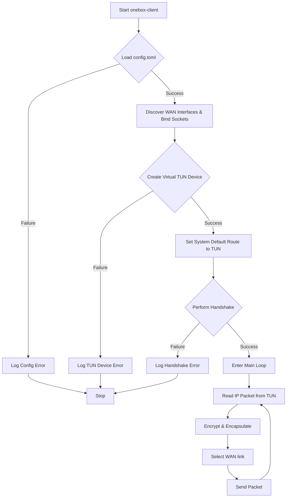

```mermaid
graph TD
    A[Start onebox-client] --> B{Load config.toml};
    B -- Success --> C[Discover WAN Interfaces & Bind Sockets];
    B -- Failure --> D[Log Config Error];
    D --> E[Stop];
    C --> F{Create Virtual TUN Device};
    F -- Success --> G[Set System Default Route to TUN];
    F -- Failure --> H[Log TUN Device Error];
    H --> E;
    G --> I{Perform Handshake};
    I -- Success --> J[Enter Main Loop];
    I -- Failure --> K[Log Handshake Error];
    K --> E;
    J --> L[Read IP Packet from TUN];
    L --> M[Encrypt & Encapsulate];
    M --> N[Select WAN link];
    N --> O[Send Packet];
    O --> L;
```
