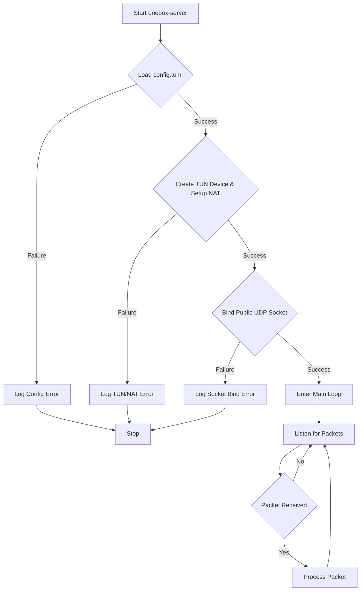

```mermaid
graph TD
    A[Start onebox-server] --> B{Load config.toml};
    B -- Success --> C{Create TUN Device & Setup NAT};
    B -- Failure --> D[Log Config Error];
    D --> E[Stop];
    C -- Success --> F{Bind Public UDP Socket};
    C -- Failure --> G[Log TUN/NAT Error];
    G --> E;
    F -- Success --> H[Enter Main Loop];
    F -- Failure --> I[Log Socket Bind Error];
    I --> E;
    H --> J[Listen for Packets];
    J --> K{Packet Received};
    K -- Yes --> L[Process Packet];
    L --> J;
    K -- No --> J;
```
