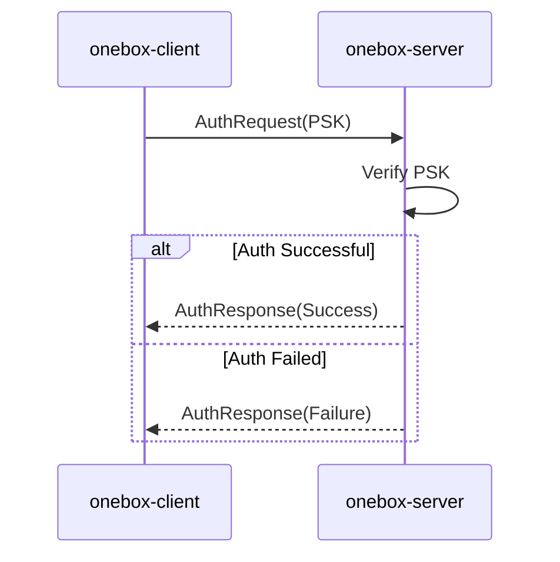

```mermaid
sequenceDiagram
    participant C as onebox-client
    participant S as onebox-server
    C->>S: AuthRequest(PSK)
    S->>S: Verify PSK
    alt Auth Successful
        S-->>C: AuthResponse(Success)
    else Auth Failed
        S-->>C: AuthResponse(Failure)
    end
```
