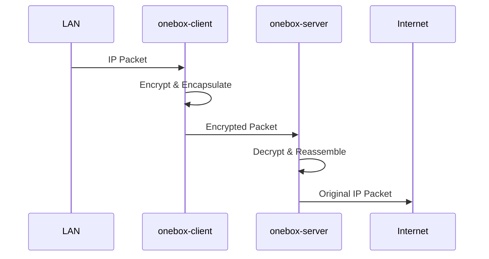

```mermaid
sequenceDiagram
    participant LAN
    participant C as onebox-client
    participant S as onebox-server
    participant Internet
    LAN->>C: IP Packet
    C->>C: Encrypt & Encapsulate
    C->>S: Encrypted Packet
    S->>S: Decrypt & Reassemble
    S->>Internet: Original IP Packet
```
