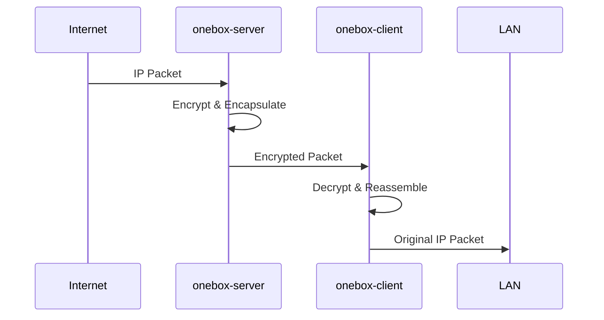

```mermaid
sequenceDiagram
    participant Internet
    participant S as onebox-server
    participant C as onebox-client
    participant LAN
    Internet->>S: IP Packet
    S->>S: Encrypt & Encapsulate
    S->>C: Encrypted Packet
    C->>C: Decrypt & Reassemble
    C->>LAN: Original IP Packet
```
