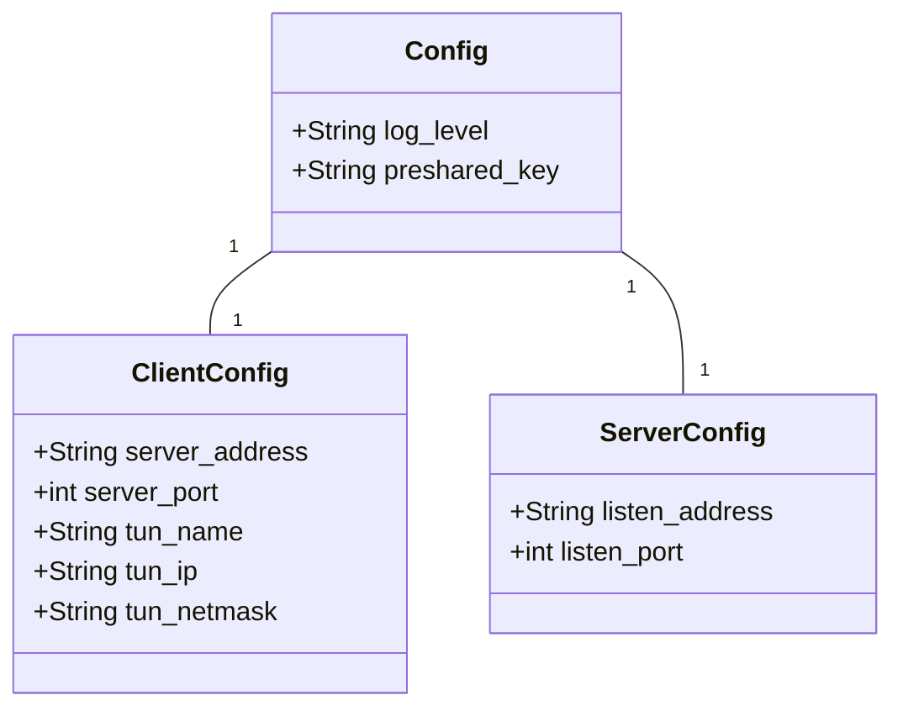

```mermaid
classDiagram
    class Config {
        +String log_level
        +String preshared_key
    }
    class ClientConfig {
        +String server_address
        +int server_port
        +String tun_name
        +String tun_ip
        +String tun_netmask
    }
    class ServerConfig {
        +String listen_address
        +int listen_port
    }
    Config "1" -- "1" ClientConfig
    Config "1" -- "1" ServerConfig
```
