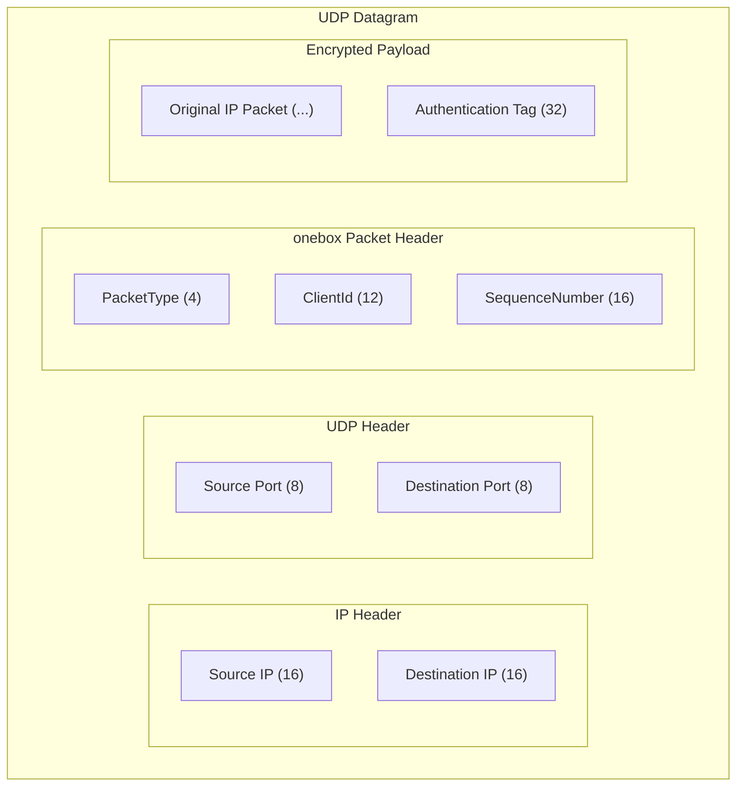

```mermaid
graph TD
    subgraph UDP Datagram
        subgraph IP Header
            A["Source IP (16)"]
            B["Destination IP (16)"]
        end
        subgraph UDP Header
            C["Source Port (8)"]
            D["Destination Port (8)"]
        end
        subgraph onebox Packet Header
            E["PacketType (4)"]
            F["ClientId (12)"]
            G["SequenceNumber (16)"]
        end
        subgraph Encrypted Payload
            H["Original IP Packet (...)"]
            I["Authentication Tag (32)"]
        end
    end
```
