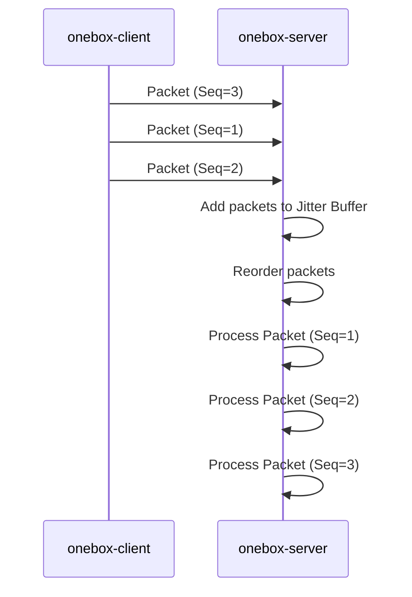

```mermaid
sequenceDiagram
    participant C as onebox-client
    participant S as onebox-server
    C->>S: Packet (Seq=3)
    C->>S: Packet (Seq=1)
    C->>S: Packet (Seq=2)
    S->>S: Add packets to Jitter Buffer
    S->>S: Reorder packets
    S->>S: Process Packet (Seq=1)
    S->>S: Process Packet (Seq=2)
    S->>S: Process Packet (Seq=3)
```
