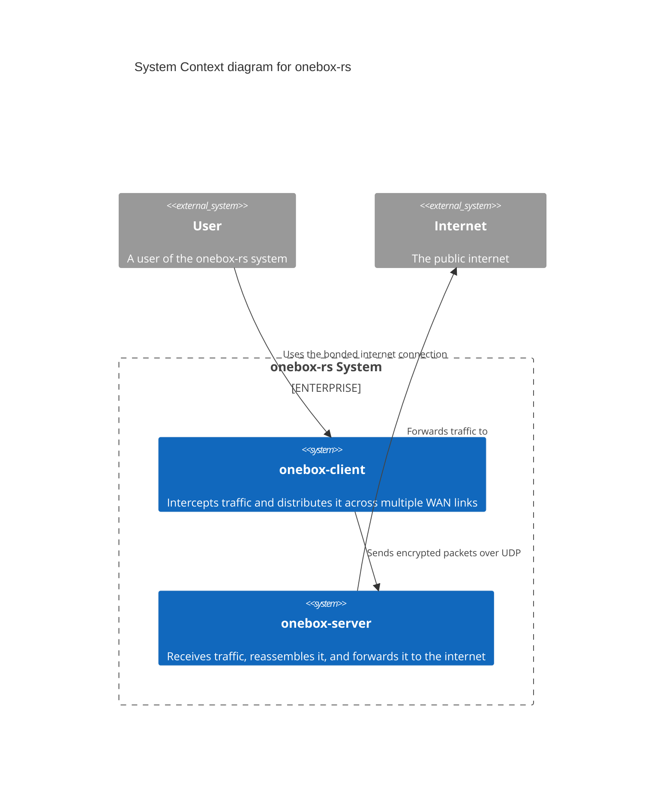

```mermaid
C4Context
  title System Context diagram for onebox-rs
  Enterprise_Boundary(b, "onebox-rs System") {
    System(client, "onebox-client", "Intercepts traffic and distributes it across multiple WAN links")
    System(server, "onebox-server", "Receives traffic, reassembles it, and forwards it to the internet")
    Rel(client, server, "Sends encrypted packets over UDP")
  }
  System_Ext(user, "User", "A user of the onebox-rs system")
  System_Ext(internet, "Internet", "The public internet")

  Rel(user, client, "Uses the bonded internet connection")
  Rel(server, internet, "Forwards traffic to")
```
