# Mermaid.js Diagrams for onebox-rs

This directory contains a comprehensive set of diagrams for the `onebox-rs` project, created using the [Mermaid.js](https://mermaid-js.github.io/mermaid/#/) syntax.

## 1. Flowcharts

### 1.1. Client Application Logic Flow

This flowchart illustrates the high-level logic of the `onebox-client` application, from startup to the main processing loop.

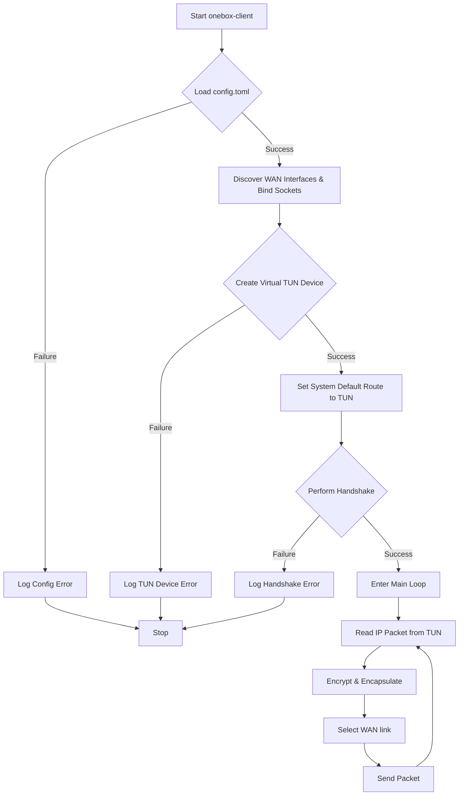

### 1.2. Server Application Logic Flow

This flowchart illustrates the high-level logic of the `onebox-server` application.

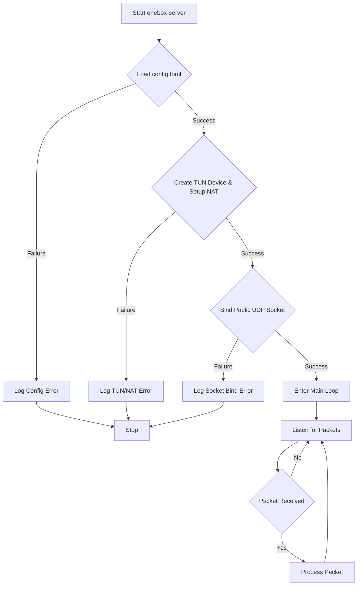

## 2. Sequence Diagrams

### 2.1. Authentication Handshake

This sequence diagram shows the interaction between the client and server during the initial authentication process.

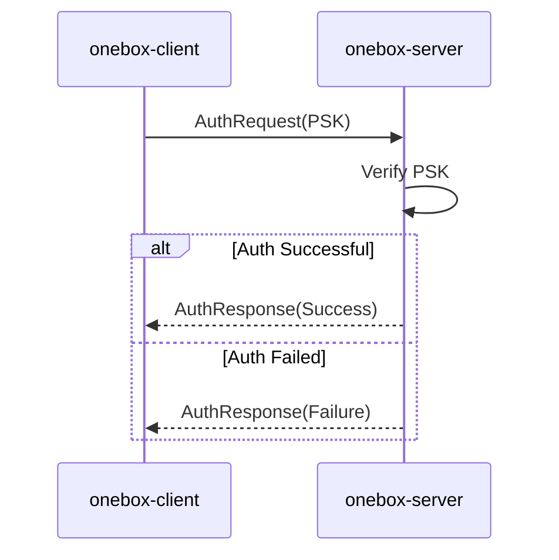

### 2.2. Upstream Data Transfer

This sequence diagram illustrates how a data packet travels from the local network, through the client, to the server, and out to the internet.

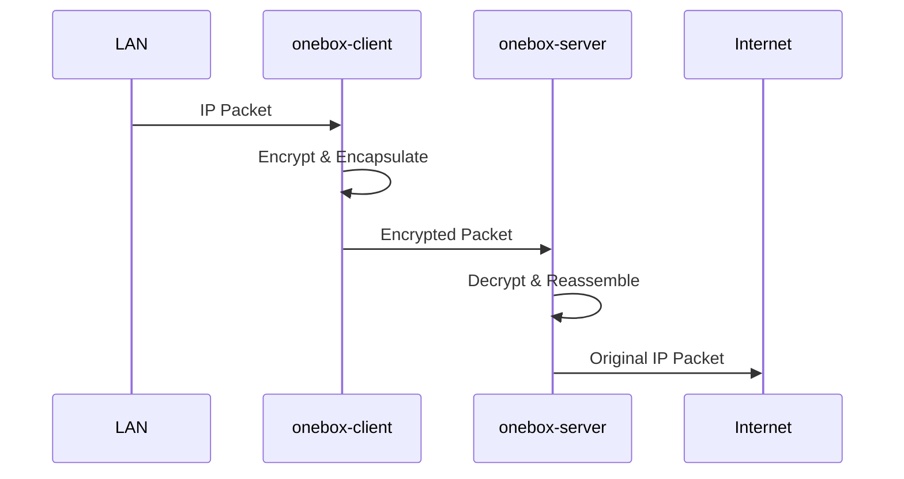

### 2.3. Downstream Data Transfer

This sequence diagram shows the reverse path of a data packet, from the internet back to the local network.

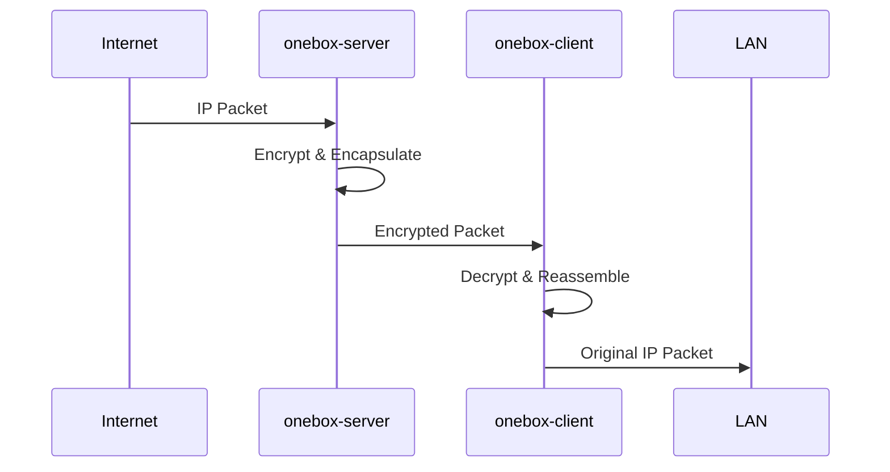

### 2.4. Link Health Probe

This sequence diagram shows the keep-alive mechanism used to monitor the health of each WAN link.

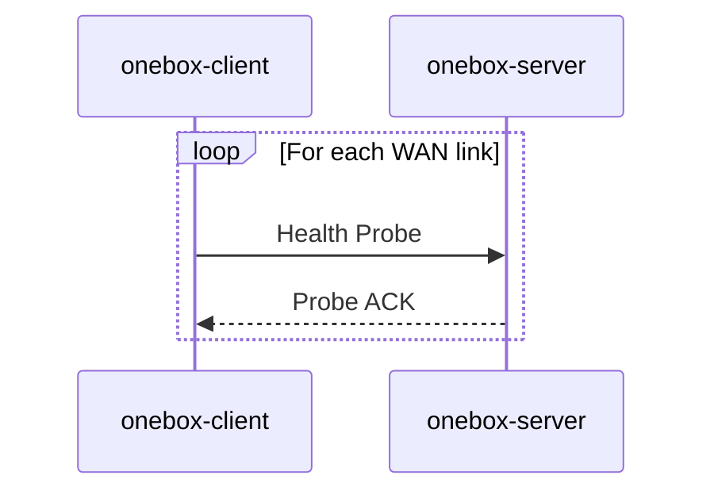

## 3. State Diagram

### 3.1. Link Health State Machine

This state diagram models the different states of a WAN link based on the success or failure of health probes.

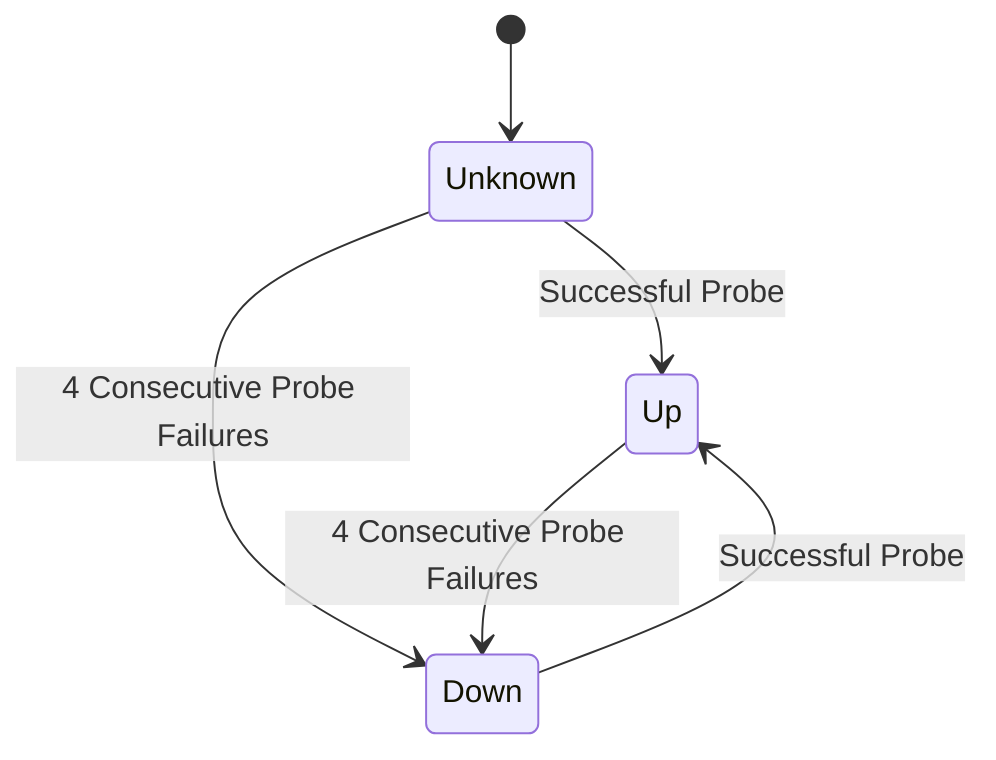

## 4. Class Diagram

### 4.1. Configuration Schema

This class diagram shows the structure of the `config.toml` file and the relationship between its sections.

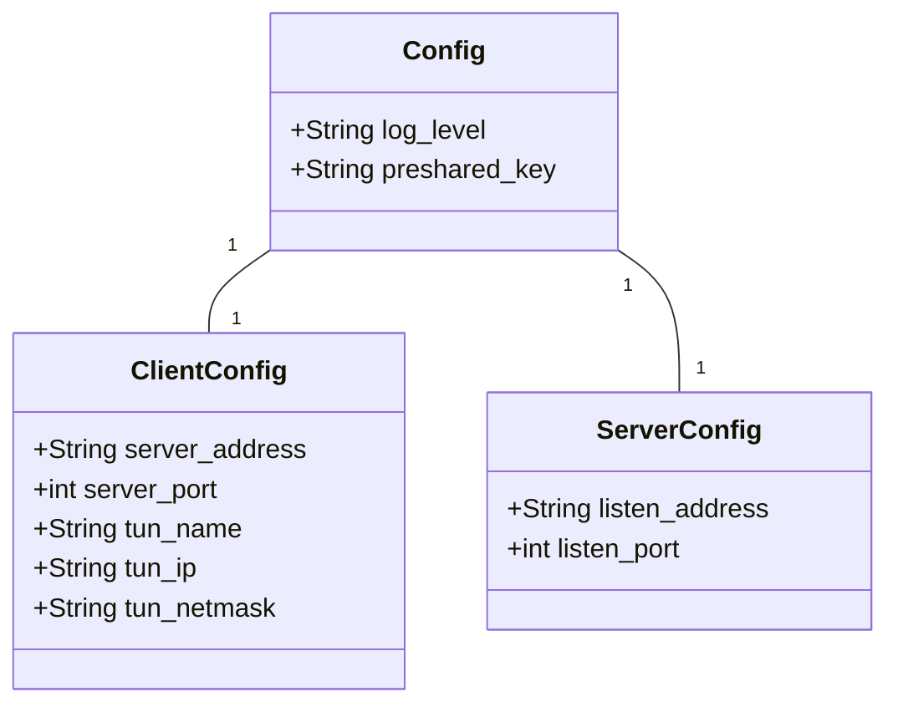

## 5. User Journey

### 5.1. CLI Usage Journey

This diagram illustrates the typical journey of a user setting up and running the `onebox-rs` application.

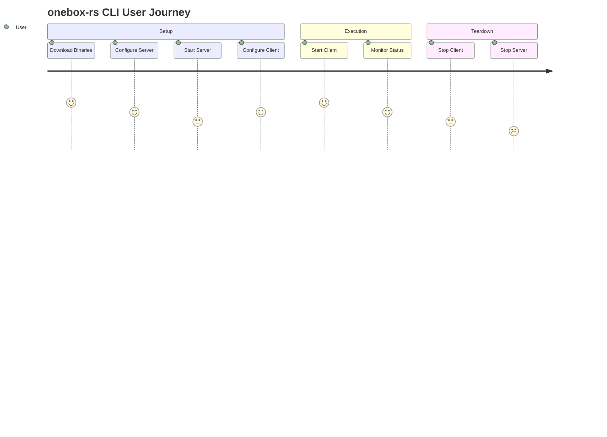

## 6. Packet Diagram

### 6.1. Packet Structure

This diagram shows the structure of a `onebox-rs` data packet as it is sent over a WAN link.

## 7. Edge Case Scenarios

These sequence diagrams illustrate how the system is expected to handle various edge cases and non-nominal conditions.

### 7.1. Invalid PSK Authentication

This diagram shows the server rejecting a client that provides an invalid Pre-Shared Key (PSK).

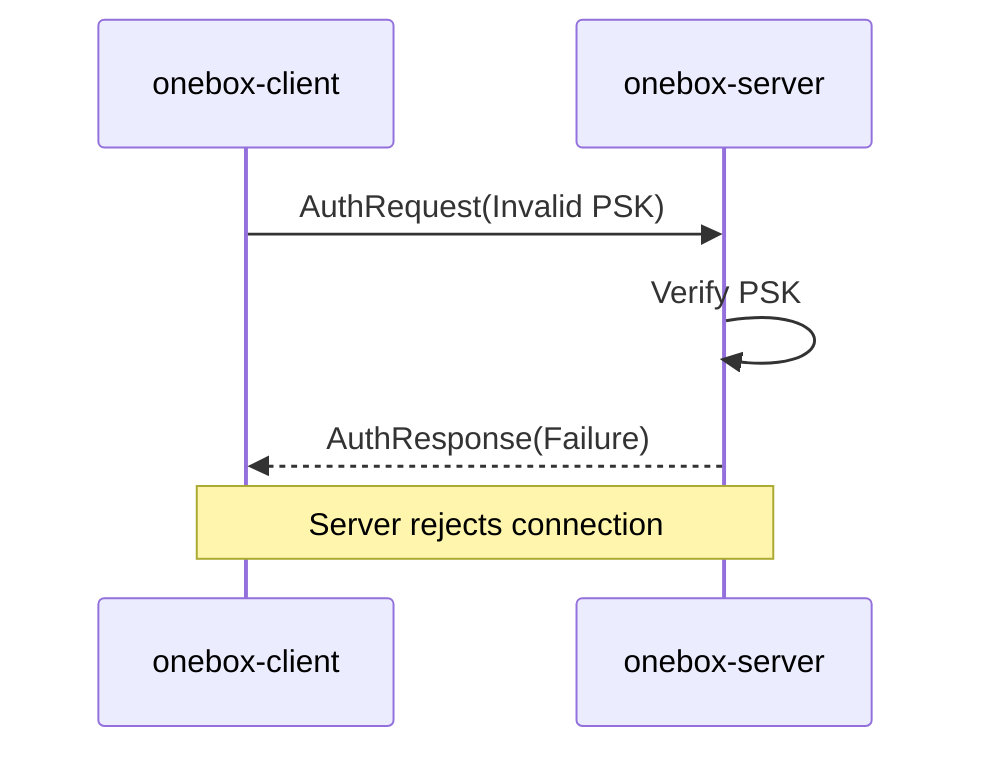

### 7.2. Malformed Packet Handling

This diagram shows the server's behavior when it receives a malformed or undecipherable packet.

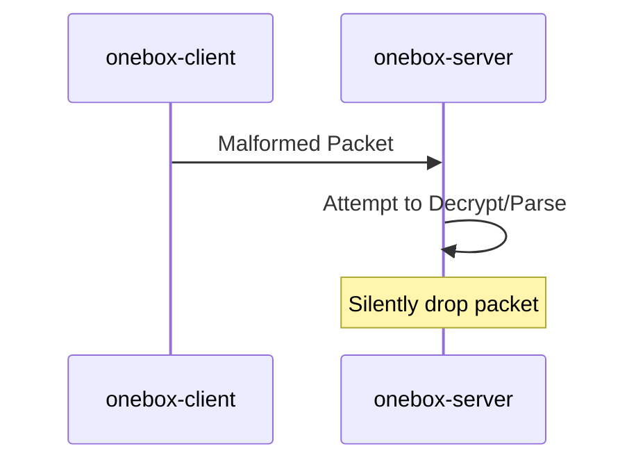

### 7.3. Link Flapping Scenario

This diagram illustrates how the client handles a "flapping" WAN link that is rapidly changing its state between up and down.

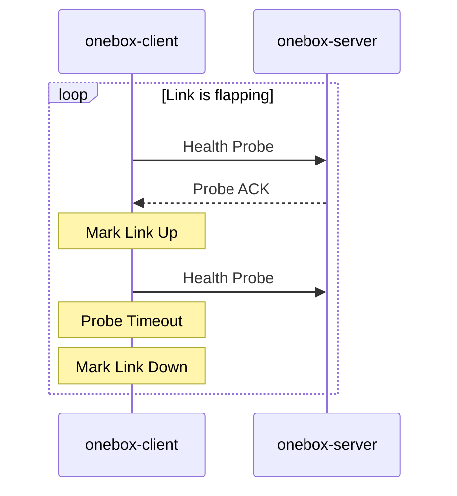

### 7.4. Out-of-Order Packet Handling

This diagram shows how the server's jitter buffer handles packets that arrive out of order from different WAN links.

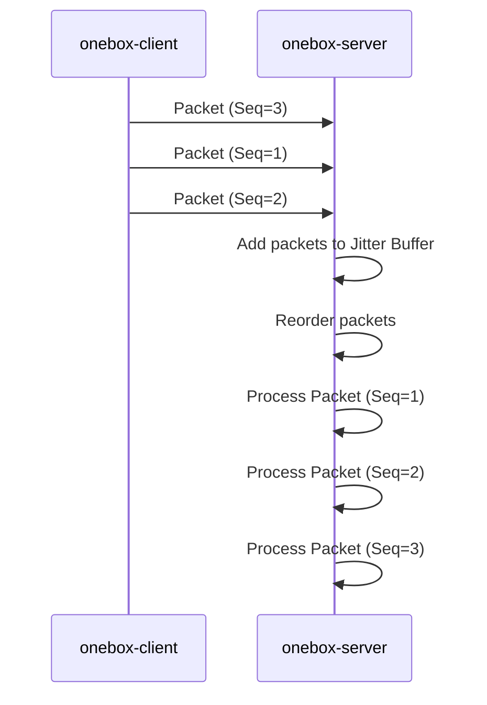

## 8. Architecture Diagram

### 8.1. System Context (C4)

This C4 diagram shows the high-level system context for the `onebox-rs` application.

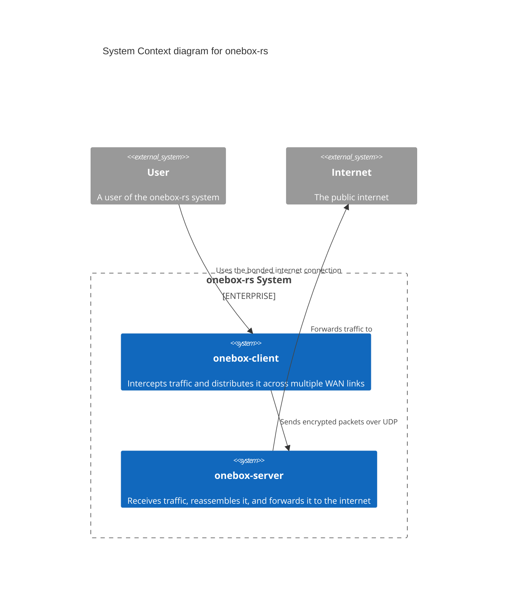
