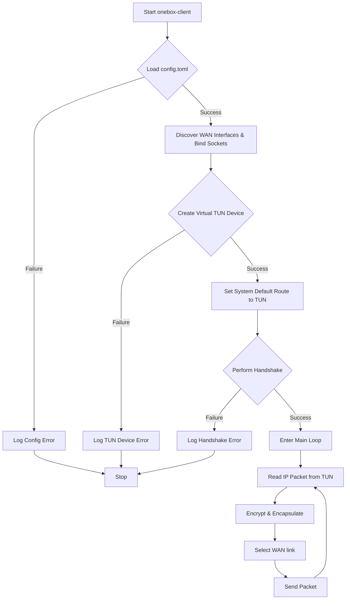
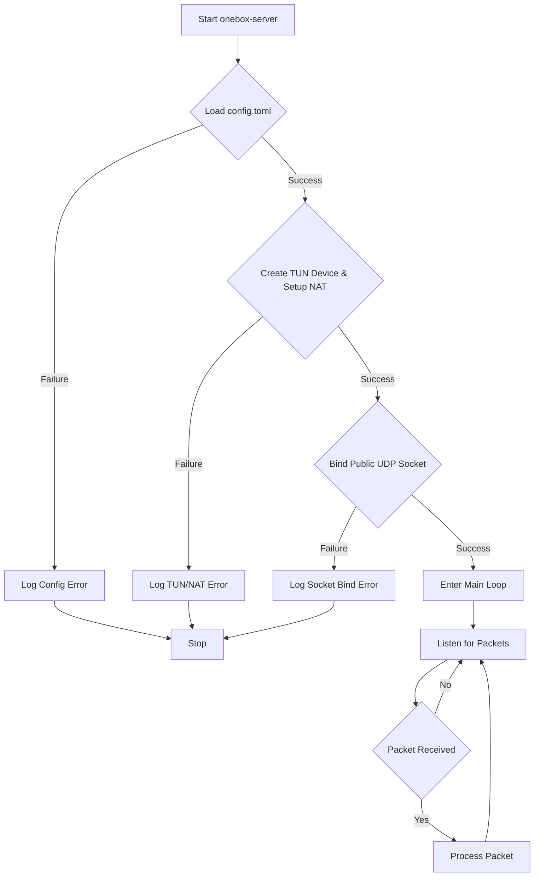
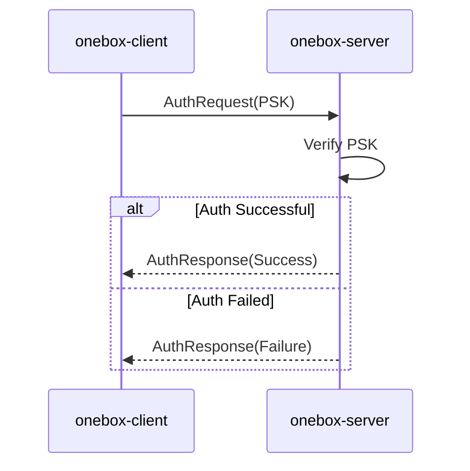
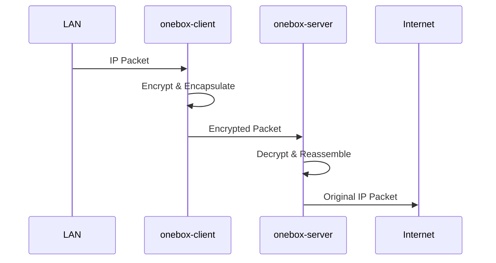
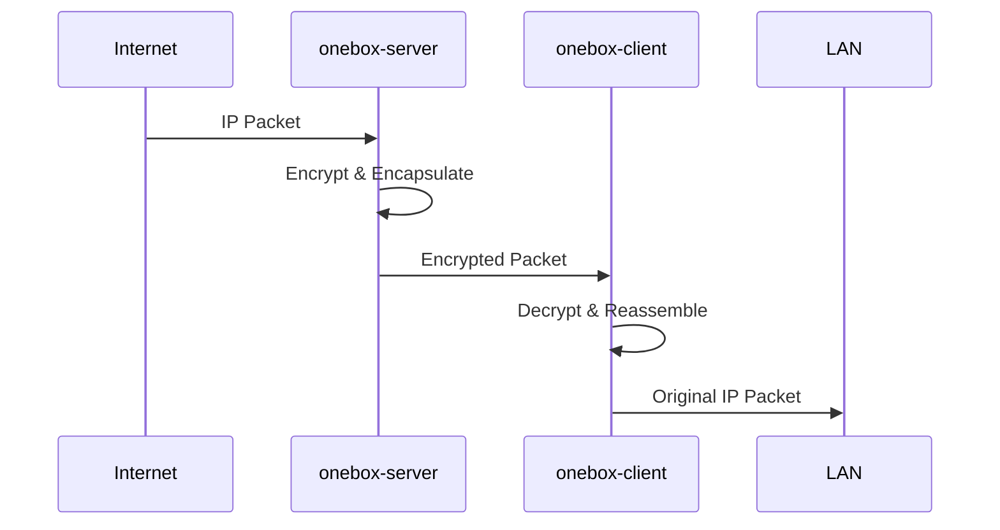
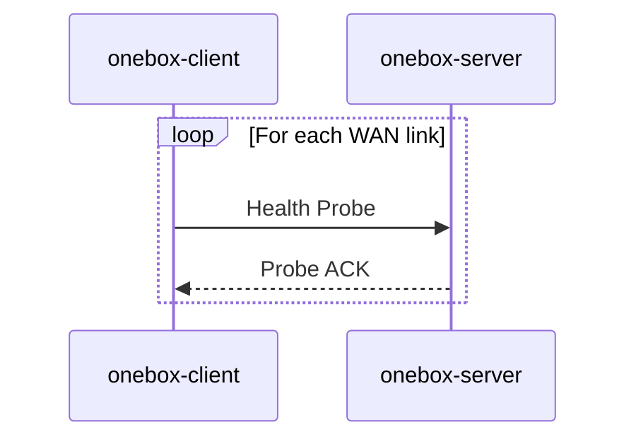
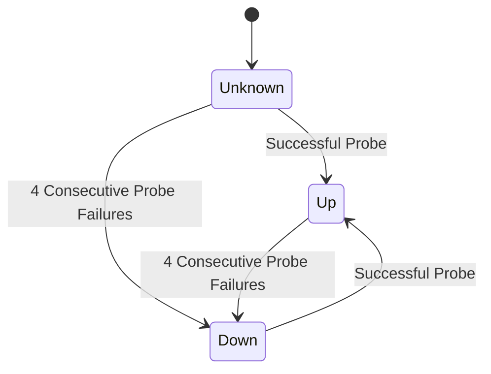
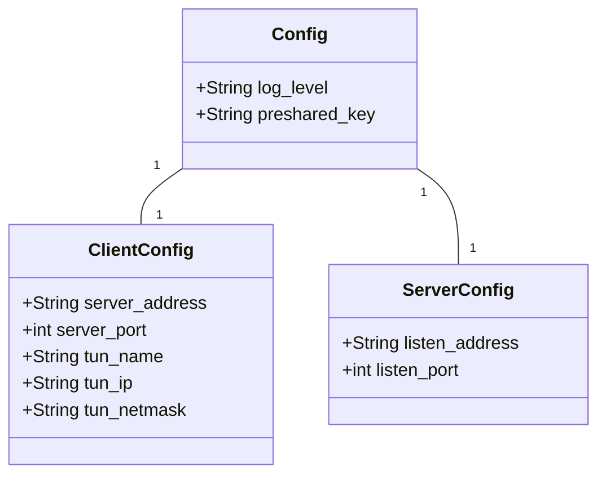
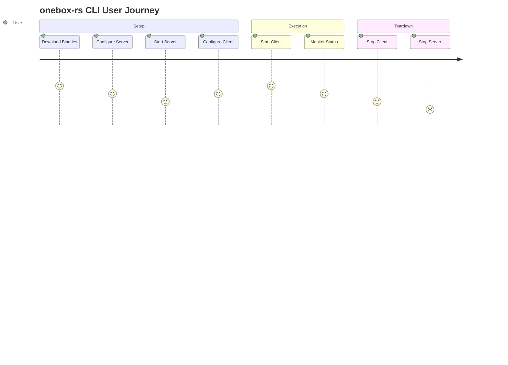

# Mermaid.js Diagrams for onebox-rs

This directory contains a comprehensive set of diagrams for the `onebox-rs` project, created using the [Mermaid.js](https://mermaid-js.github.io/mermaid/#/) syntax.

## 1. Flowcharts

### 1.1. Client Application Logic Flow

This flowchart illustrates the high-level logic of the `onebox-client` application, from startup to the main processing loop.

### 1.2. Server Application Logic Flow

This flowchart illustrates the high-level logic of the `onebox-server` application.

## 2. Sequence Diagrams

### 2.1. Authentication Handshake

This sequence diagram shows the interaction between the client and server during the initial authentication process.

### 2.2. Upstream Data Transfer

This sequence diagram illustrates how a data packet travels from the local network, through the client, to the server, and out to the internet.

### 2.3. Downstream Data Transfer

This sequence diagram shows the reverse path of a data packet, from the internet back to the local network.

### 2.4. Link Health Probe

This sequence diagram shows the keep-alive mechanism used to monitor the health of each WAN link.

## 3. State Diagram

### 3.1. Link Health State Machine

This state diagram models the different states of a WAN link based on the success or failure of health probes.

## 4. Class Diagram

### 4.1. Configuration Schema

This class diagram shows the structure of the `config.toml` file and the relationship between its sections.

## 5. User Journey

### 5.1. CLI Usage Journey

This diagram illustrates the typical journey of a user setting up and running the `onebox-rs` application.

