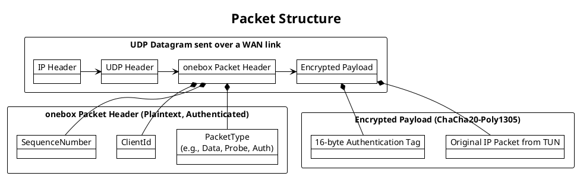
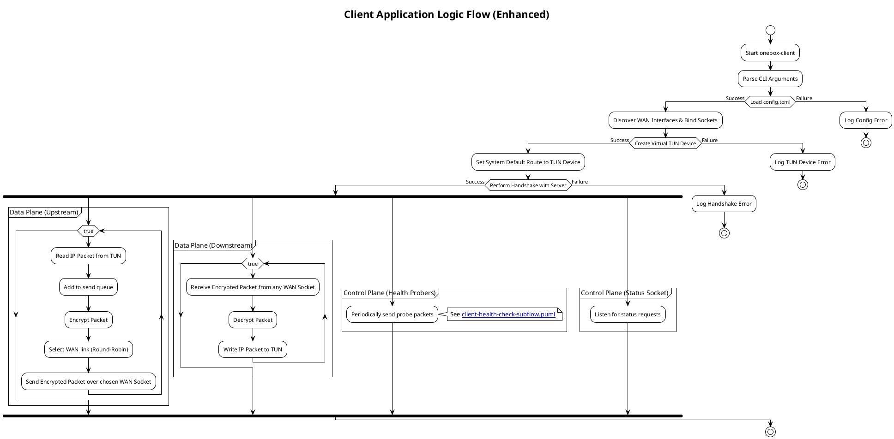
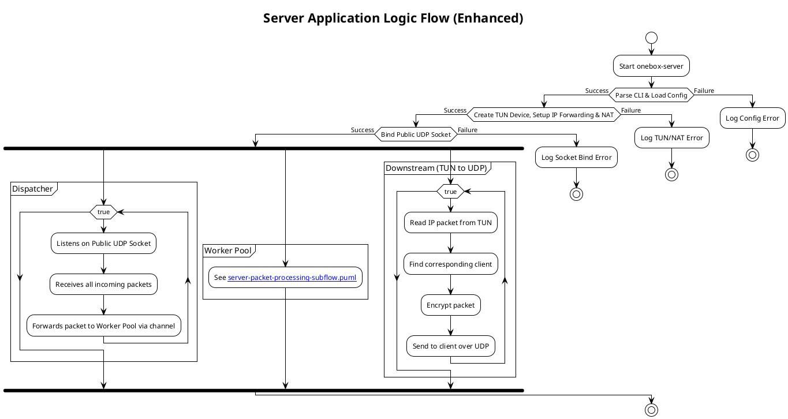
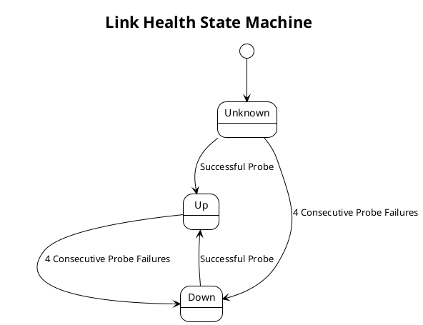
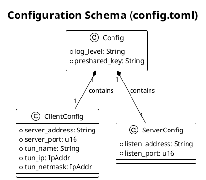

# PlantUML Diagrams

This directory contains the source files for project diagrams created using the PlantUML syntax.

## 1. System Architecture

```plantuml
@startuml
!theme plain

title System Architecture

package "User's LAN" {
  [PC / Laptop] as PC
  [onebox-client] as Client
  PC --> Client : All Traffic
}

package "onebox-client Device" {
  Client --> TUNNEL_Client : Intercepts & Encapsulates
  interface "TUNNEL" as TUNNEL_Client
  TUNNEL_Client --> [WAN 1\n(e.g., Ethernet)] : Round-Robin
  TUNNEL_Client --> [WAN 2\n(e.g., Cellular)] : Round-Robin
}

package "Public Internet" {
  [WAN 1\n(e.g., Ethernet)] --> Server : Encrypted UDP
  [WAN 2\n(e.g., Cellular)] --> Server : Encrypted UDP
}

package "Cloud VPS" {
  [onebox-server] as Server
  Server --> TUNNEL_Server : Reassembles & Decrypts
  interface "TUNNEL" as TUNNEL_Server
  TUNNEL_Server --> [Internet]
}

@enduml
```

## 2. Packet Structure



## 3. Client Application Logic Flow



## 4. Server Application Logic Flow



## 5. Link Health State Machine



## 6. Configuration Schema


